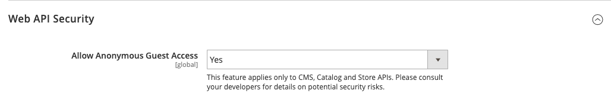
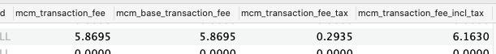
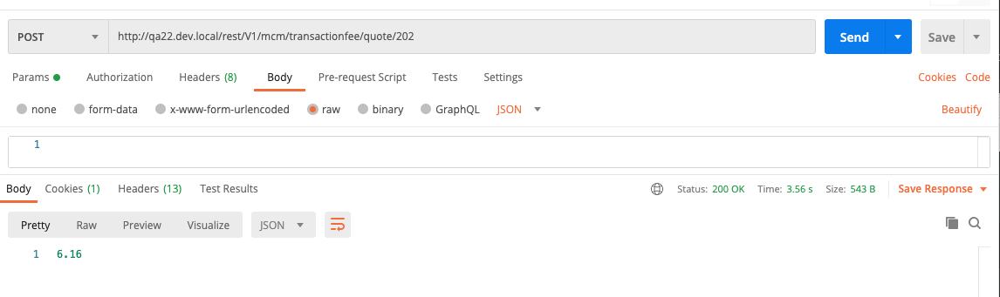

# Omnyfy MCM
## Requirements
1. Please ensure that Guest Web API is enabled (screenshot)
```
Stores > Settings > Configuration > Services > Magento Web API > Web API Security.
```


## API
API current quote transaction fee:
```
PARAMS: {quoteId}
POST http://{{marketplaceurl}}/rest/V1/mcm/transactionfee/quote/{quoteId}
```





Request Body (will return an integer value that is the current quote/cart transaction fee in database):
```
6.1630
```
